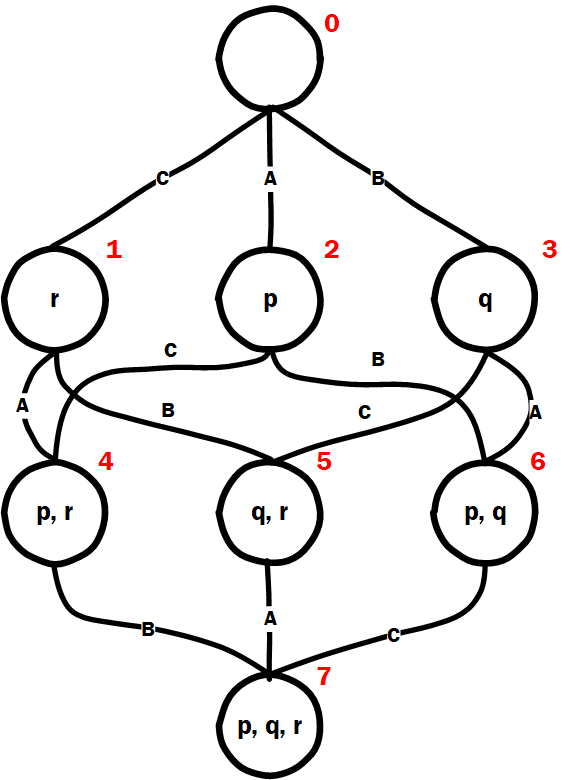

# Analysis

This section will show the 'on paper' analysis of the muddy children riddle with three children who are all muddy. 

There are three children: Alice, Bob and Carol. 

The propositions p, q and r stand for:
p = Alice is muddy
q = Bob is muddy
r = Carol is muddy

The first proposition states whether any of the children know they are muddy at the start of the riddle:

K{A}p | K{A}~p | K{B}q | K{B}~q | K{C}r | K{C}~r

Looking at the model at this point (seen below) we can analyze K{A}p for example:

 M |= K{A}p    	⇔ 
 p must be true in all worlds connected by the A relation
 π(w_1)(p) = f
 So K{A}p is not valid in the given model.
 
Repeating this for all atoms given in the first proposition shows they are all not valid in the current model.

------------------------------------------------------------------------------------------------------------------

The second proposition states that after the first announcement that at least one child is muddy. Do any of the children know whether they are muddy?

(K{A}p | K{A}~p | K{B}q | K{B}~q | K{C}r | K{C}~r)

The new model is shown below

			INSERT MODEL 2

After this announcement w_0 is removed as possibility but the atoms in the proposition are still all invalid as shown for the first proposition.

-----------------------------------------------------------------------------------------------------------------

The third proposition states that since no one has stepped forward yet, which can be represented as an announcement. After the second announcement that at least one child is muddy, do any of the children know whether they are muddy?

[(p | q | r)][~(K{A}p | K{A}~p | K{B}q | K{B}~q | K{C}r | K{C}~r)](K{A}p | K{A}~p | K{B}q | K{B}~q | K{C}r | K{C}~r)

It is now necessary that at least one child is muddy and that none of the children after the first announcement know whether they are muddy. Image that only one child was muddy, this child would have stepped forward after the first announcement as it could see the other two children not being muddy in combination with at least one child being muddy would make this child step forward. This is known to all the children thus the model changes and can be seen below:

			INSERT MODEL 3

At this point no child is still sure about their own muddyness since there are still 4 worlds left which still makes all atoms in the proposition invalid.

--------------------------------------------------------------------------------------------------------------------

The fourth proposition is states that no one has stepped forward yet, which can be represented as an announcement. After the third announcement that at least one child is muddy, do any of the children know whether they are muddy?

[(p | q | r)][~(K{A}p | K{A}~p | K{B}q | K{B}~q | K{C}r | K{C}~r)][~(K{A}p | K{A}~p | K{B}q | K{B}~q | K{C}r | K{C}~r)](K{A}p | K{A}~p | K{B}q | K{B}~q | K{C}r | K{C}~r)

Now three more worlds disappear which means that only w_7 is possible.

			INSERT MODEL 4

 M |= K{A}p, K{B}q, K{C}r    	⇔
 p, q and r must be true all worlds connected respectively by relations A, B and C.
 π(w_7)(p) = t,  π(w_7)(q) = t, π(w_7)(r) = t
 Thus the whole proposition is true.
 

 
