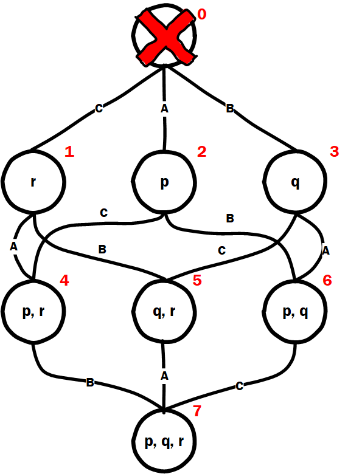
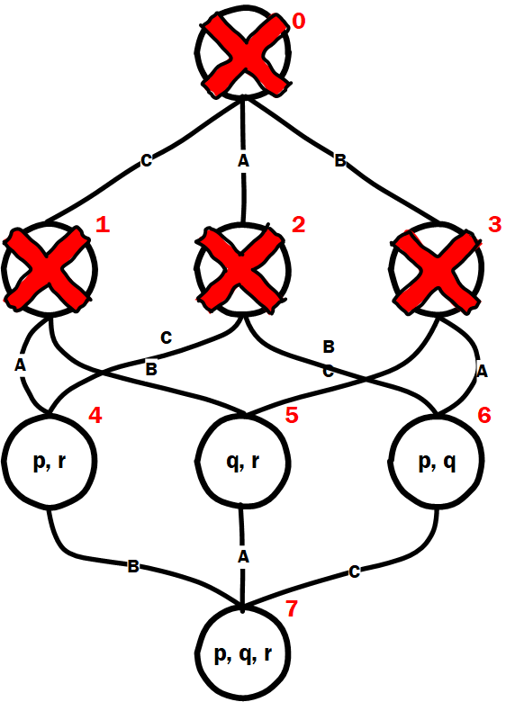
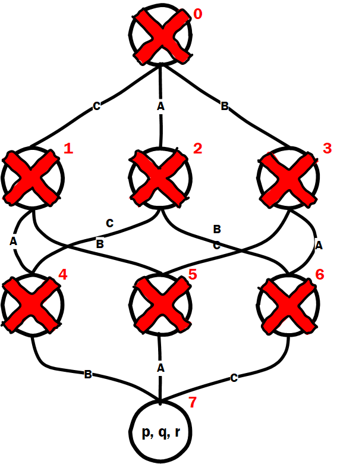

# Analysis

This section will show an analysis of the Muddy Children riddle with three children who are all muddy. This analysis can be done by hand, but our system is designed to allow for an easy transition from manual analyses to analyses with our solver. In fact, the propositions shown here can be entered directly into our system. The system parses these propositions and evaluates them according to the specified Kripke model. 

------------------------------------------------------------------------------------------------------------------

There are three children: Alice, Bob and Carol. 

The propositions p, q and r stand for:  
p = Alice is muddy  
q = Bob is muddy  
r = Carol is muddy  

The following proposition can be read as "Do any of the children know whether they are muddy?":  

```plain
K{A}p | K{A}~p | K{B}q | K{B}~q | K{C}r | K{C}~r
```

Looking at the model at this point (seen below) we can analyze K{A}p for example:


```plain
 M ⊨ K{A}p    	⇔ 
 p must be true in all worlds connected by the A relation
 π(w_1)(p) = f
 So K{A}p is not valid in the given model.
 ```
 
Repeating this process for all disjuncts given in the proposition shows they are all invalid in the current model.

------------------------------------------------------------------------------------------------------------------

The following proposition is the second step in the Muddy Children problem. It can be read as: "After the announcement that at least one child is muddy, do any of the children know whether they are muddy?"

```plain
<p | q | r>(K{A}p | K{A}~p | K{B}q | K{B}~q | K{C}r | K{C}~r)
```

The new model is shown below



After this announcement w<sub>0</sub> is removed as a possibility (due to the fact that in w<sub>0</sub> no child would be muddy) but the atoms in the proposition are still all invalid as shown for the first proposition.

-----------------------------------------------------------------------------------------------------------------

No one steps forward yet again, which can be formulated as a public announcement that states that no child knows whether they are muddy.
The following (third) proposition includes that announcement. The proposition can be read as follows: "After the announcements that at least one child is muddy and no child knows whether they are muddy, do any of the children know whether they are muddy?"

```plain
[(p | q | r)][~(K{A}p | K{A}~p | K{B}q | K{B}~q | K{C}r | K{C}~r)](K{A}p | K{A}~p | K{B}q | K{B}~q | K{C}r | K{C}~r)
```

It is now necessary that at least one child is muddy and that none of the children after the first announcement know whether they are muddy. Imagine that only one child was muddy, this child would have stepped forward after the first announcement as it could see the other two children would not be muddy. This is known to all the children thus the model changes and can be seen below:




At this point no child is still sure about their own muddyness since there are still 4 worlds left which still makes all disjuncts in the proposition invalid.

--------------------------------------------------------------------------------------------------------------------

The fourth proposition states that no one has stepped forward yet, which can be represented as an announcement. After the third announcement that at least one child is muddy, do any of the children know whether they are muddy?

```plain
[(p | q | r)][~(K{A}p | K{A}~p | K{B}q | K{B}~q | K{C}r | K{C}~r)][~(K{A}p | K{A}~p | K{B}q | K{B}~q | K{C}r | K{C}~r)](K{A}p | K{A}~p | K{B}q | K{B}~q | K{C}r | K{C}~r)
```

Now three more worlds disappear which means that only w_7 is possible.



```plain
 M ⊨ K{A}p, K{B}q, K{C}r    	⇔
 p, q and r must be true all worlds connected respectively by relations A, B and C.
 π(w_7)(p) = t,  π(w_7)(q) = t, π(w_7)(r) = t
 Thus the whole proposition is true.
 ```
 


 
